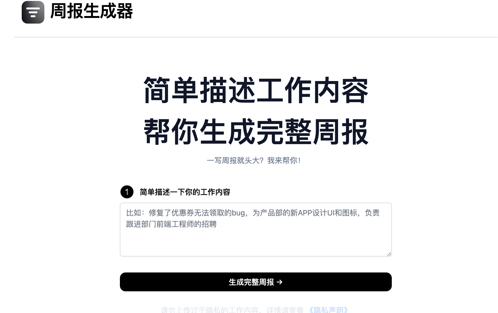

# 周报生成器

如果你比较讨厌写周报，那么，这个周报生成器你可以了解一下，这是一个开源项目，项目地址：[https://github.com/guaguaguaxia/weekly_report](https://github.com/guaguaguaxia/weekly_report)

## 使用方法

:::tip

注意：这个应用是基于 GPT3.5，需要使用到 API key，如果你没有 ChatGPT 的账号，可以使用我提供的 key 来测试，但是因为 API 是付费产品，我们牛马程序员是小机构，而且快破产了，让我们付费开通账号，然后免费给大家白嫖，这是绝对不可能的，哈哈

解决方案：

1、自己去官网注册 ChatGPT 账号，会赠送 5 美金的 API 额度

2、使用我们每天提供的免费额度，每天我们提供的免费额度用完了，等第二天我们充值进去，如果你想要独享一个 key 的额度，可以联系我们充值，5 块钱起充，可以玩很久

:::

以下是有一定编程基础的同学具体的步骤：

第 1 步，克隆项目

```
git clone https://github.com/nodeing/weekly_report.git
```

注意：上面这个地址是我 fork 了原作者项目，然后添加了 api 代理支持，以优化访问速度，如果你使用了上面我 fork 的项目，那么就不能使用原来 openai 提供的 key 了

要想使用 openai 的 key，请克隆下面这个项目

```
git clone https://github.com/guaguaguaxia/weekly_report.git
```

第 2 步，进入到这个项目，安装依赖

```
cd weekly_report
```

```
npm install
```

第 3 步，把项目下面，.env.example 这个文件，重命名为.env,然后填入你的 key

```
# 这里填上你的key，把xxx换成你的key
OPENAI_API_KEY=xxx
```

第 4 步，运行项目

```
npm run dev
```

浏览器打开，访问

```
http://localhost:3000
```



到此为止，可以正常使用了

## 原理和纯小白使用步骤

这个项目使用的是 GPT3.5 的模型来生成的内容，然后将内容以周报的形式给你展示出来，核心原理其实很简单，也就是一句提示词搞定：

```
请帮我把Text的工作内容填充为一篇完整的周报,尽量避免在回答内容中出现可能在中国是敏感的内容，用markdown格式以分点叙述的形式输出
Text:{{}}
```

你把这个提示词放到任何的 ChatGPT 客户端中，都可以得到差不多的结果


上面我用的这个客户端，可以参考这篇文章:

[国内稳定版 GPT 使用指南](/article/ai/chatgpt/1.html)
