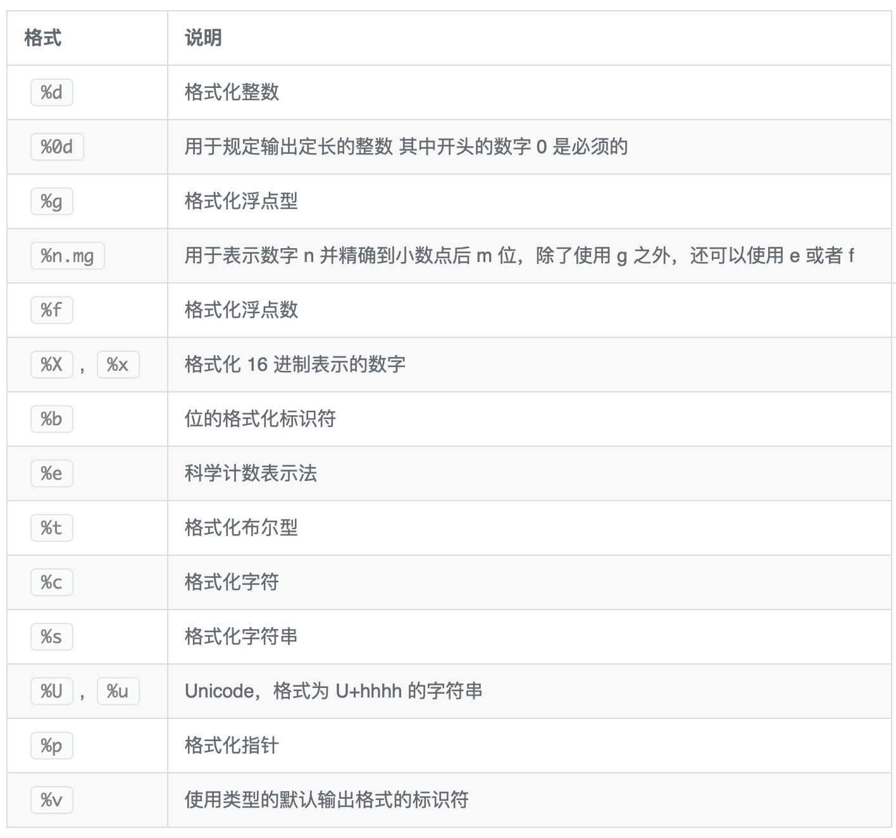

# 变量和常量

## 变量

什么是变量？通俗的说，变量就是用于描述计算机中的数据存储空间，用来存储数据的，声明(定义)一个变量，就是在计算机内存中开辟一块临时的存储空间，用于存放数据，因此，你也可以理解为变量就是计算机内存中的一块临时存储空间，用来存放数据的，这里面有两个核心的关键字，第一个是数据，第二个是存储空间，在计算机中大家可以看到的声音、文字、图片、视频等都是数据，而存储空间大家可以类别一套房子，用来住人，结合下面的图理解一下


如果往上图中的格子里面存东西，这个格子就是一块存储空间，东西存好以后如何方便的去取出来呢？比较好的方案就是给这个格子命名，根据名字来取里面的东西，我们说的变量声明其实就是开辟一块这样的格子 然后取一个名字，以后就根据这个名字来存取数据

#### 声明变量

变量声明语法

```go
// var 变量名  类型
var num int
```

```go
import "fmt"

func main() {
    // 声明一个存放整数的变量 变量名 age
	var age int
	fmt.Println(age)
}
```

同时声明多个变量

```go
import "fmt"

func main() {
	var num1,num2 int
	fmt.Println(num1, num2)
}
```

变量初始化，即在声明的时候就给它赋值

```go
package main

import "fmt"

func main() {
	var num1 int = 20
	fmt.Println(num1)
}
```

变量定义以后再赋值

```go
package main

import "fmt"

func main() {
	var num1, num2 int
	num1 = 20
	num2 = 30
	fmt.Println(num1, num2)
}
```

自动推导类型

```go
package main

import "fmt"

func main() {
	num1 := 10
	fmt.Println(num1)
}
```

声明变量的时候，不用给变量设置具体类型，而是根据赋值的内容自动推导，注意： 冒号(:)和等号(=) 中间没有空格

多个变量的声明与赋值

```go
package main

import "fmt"

func main() {
	num1, num2, num3 := 10,20,30
	fmt.Println(num1, num2, num3)
}
```

## 变量命名规范

变量命名规范需要遵循以下几条：

1. 只能由字母、数字，下划线(\_)组成

2. 不能以数字开头

3. 区分大小写，意味着 num 和 Num 是两个不同的变量

4. 不能是关键字

以下是 go 语言中的关键字

```go
break default func interface select case
defer go map struct chan else goto  package
switch const fallthrough if range type continue
for  import  return  var
```

以上关键字你不能用于变量的命名

5. 见词达意

## 输入输出格式控制

输出内容，我们需要引入 fmt 包，我们简单介绍这个包里面的几个函数

Println 和 Print，这两个函数都可以输出内容，区别在于 Println 可以换行输出，Print 默认不换行

```go
package main

import "fmt"

func main() {
	num1, num2, num3 := 10,20,30
	fmt.Print(num1, num2, num3)
	fmt.Print(num1, num2, num3)

	fmt.Println(num1,num2,num3)
	fmt.Println(num1,num2,num3)
}
```

Printf 函数，表示格式化输出，意味着你需要知道一些它的输出格式

语法：

```go
fmt.Printf(格式化样式, 参数列表…)
```

案例

```go
package main

import "fmt"

func main() {
	num1 := 20
	fmt.Printf("num=%d", num1)
}

```

还有一个函数 Sprintf,这个函数和 Printf 用法一样，区别是 Sprintf 返回格式化后的内容，你需要用一个变量来接收它

```go
package main

import "fmt"

func main() {
	num1 := 20
	// 定义变量来接收
	s := fmt.Sprintf("num=%d", num1)
	fmt.Printf(s)
}

```



## 常量

在我们编程的过程中，有些时候一个值确定以后是不允许修改的，而变量的特点是可变的，你可以随时修改，如果要满足我们不可修改的需求，需要需要使用到常量

#### 常量的定义

使用 const 关键字来定义常量，建议使用大写字母来命名

```go
package main

import "fmt"

func main() {
	const PI = 3.14
	fmt.Printf("num=%.2f", PI)
}

```

#### 常量的命名规范

常量命名规范和变量差不多，具体如下

1. 只能由字母、数字，下划线(\_)组成

2. 不能以数字开头

3. 区分大小写，意味着 num 和 Num 是两个不同的变量

4. 不能是关键字

5. 见词达意

6. 建议使用全大写字母

7. 多个单词组成的常量，使用全大写字母+下划线的形式，例如：APP_NAME

```go
const APP_NAME = "nodeing"
```
