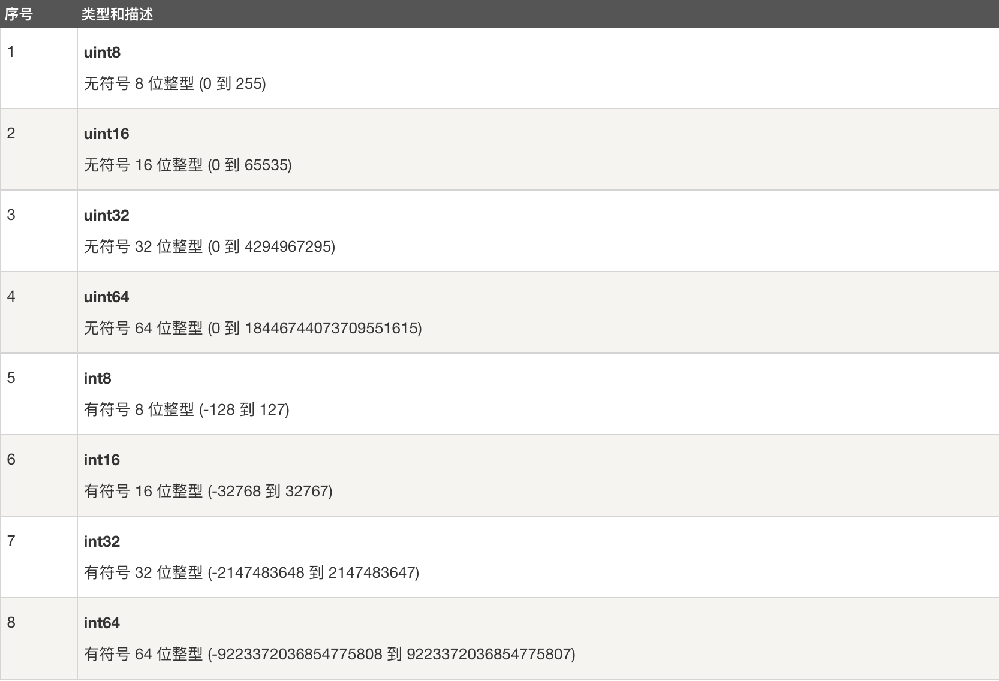

# 基础数据类型

数据类型通俗的说就是对数据进行分类，每种数据到底属于什么分类，我们给这个分类取一个名字，例如：整型、浮点型、布尔型等，因此，学习数据类型，你需要掌握的就是数据类型到底分了哪些类，以及每种类型里面的值到底是什么特点，基于什么特点把它们归类的

## 整型

从两个方面来了解整型，一是分类，二是范围

#### 整型分类

整型分为两类

```go
int 有符号整型
uint 无符号整型
```

有符号整型：包含正整数、负整数、0

```go
var num int
```

如果你存储一个浮点数，就会超过它的存储范围而报错

```go
package main

import "fmt"

func main() {
	var num int
	num = 3.14
	fmt.Printf("num=%f", num)
}

```

有符号整型：正整数、0

```go
var num uint
```

如果你给 num 这个无符号整型赋值一个 负数，那么超过了它的范围就会报错

```go
package main

import "fmt"

func main() {
	var num uint
	num = -10
    // 报错
	fmt.Printf("num=%d", num)
}
```

如果有变量不允许存储负数就可以直接声明成无符号整型

#### 整型的范围

有符号整型

```
32位系统：int占4个字节，范围：-2417483648 到 2147483647
64位系统：int占8个字节，范围：-9223372036854775808 到 9223372036854775807
```

无符号整型

```
32位系统：uint占4个字节，范围：0到4294967295
64位系统：unit占8个字节，范围：0到18446744973709551615
```

说一下字节相关单位

```
位：bit，最小存储单位
字节：Byte，基本存储单位，用大写的B来表示，1B = 8bit
1KB = 1024B，1MB=1024KB,1G=1024MB
```

更详细的类型，请参考下图



## 浮点类型

如果想存储小数，需要声明一个浮点类型的变量，在 Go 语言种提供了两种精度的浮点型：float32 和 float64，float32 精确到小数点后 7 位，float64 精确到小数点后 15 位

格式化输出浮点型，可以控制输出位数

```go
package main

import "fmt"

func main() {
	var num float64
	num = 3.1415926
	fmt.Printf("num=%0.2f", num)
}

```

可以打印自动类型推导默认的浮点类型

```go
package main

import "fmt"

func main() {
	num := 3.14
	fmt.Printf("num的类型：%T", num)
}

```

## 布尔类型

在计算机中如何表示一句话的对错呢？例如：3 大于 2 的结果？这个时候就要用到布尔型

布尔类型只有两种结果，要么是真，要么是假，我们分别用 true 和 false 来表示

```go
package main

import "fmt"

func main() {
	var flag bool
	fmt.Printf("flag的值：%v", flag) //false
}

```

自动类型推导

```go
package main

import "fmt"

func main() {
	flag := true
	fmt.Printf("num的值：%v", flag)    //num的值：true
	fmt.Printf("flag的类型是：%T", flag) //flag的类型是：bool

}

```

总结：布尔类型主要是用来做条件判断的，只有两个值，简单但是很重要

## 字符类型和字符串类型

在日常生活中，我们通常会用到字母 A、B、C、D 等，用来表示等级、用来表示试题的答案等，在计算机中，这些内容我们都称为字符，这一类型我们叫做字符类型

在 Go 语言中，字符类型表现为使用单引号引起来的单个字符

```go
package main

import "fmt"

func main() {
	var a byte = 'a'
	fmt.Println(a)            // 97
	fmt.Printf("a的类型是：%T", a) //a的类型是：uint8
}

```

上面输出 97 的原因是字母 a 的 ASCII 码对应的值就是 97， ASCII 是一套字符集，美国国家标准局(ANSI)制定的，全称 American Standard Code for Information Interchange


字符类型只能存储单个字符，如果想存储多个字符，例如，一个人的姓名，这肯定不属于单个字符了，如果想要存储多个字符，我们应该使用字符串类型

字符串类型的特点是用双引号，换句话说就是用双引号引起来的字符是字符串类型

```go
package main

import "fmt"

func main()  {
	var name string =  "xiaoqiang"
	fmt.Println(name)
}
```

注意：不管是单个字符还是多个字符，只要是双引号括起来的，都是字符串类型

```go
package main

import "fmt"

func main()  {
	name := "a"
	fmt.Printf("类型是：%T", name)  // 类型是：string
}
```

知识点： 统计字符串里面的字符个数，使用 len 函数

```go
package main

import "fmt"

func main()  {
	name := "xiaoqiang"
	fmt.Printf("字符个数是：%d", len(name))  // 字符个数是：9
}
```

知识点：Go 语言中，一个汉字，占 3 个字符

```go
package main

import "fmt"

func main()  {
	name := "螺钉大叔"
	fmt.Printf("字符个数是：%d", len(name))  // 字符个数是：12
}
```

知识点总结：字符串和字符串类型的区别

```
1. 字符使用单引号，并且包含一个字符
2. 字符串使用双引号，并且包含0个或多个字符，0个表示空字符串
3. 可以使用 len 函数来测试字符串长度
4. 一个汉字占3个字符
```

## 强类型转换

类型转换就是将一种类型的变量转换成另一种类型的变量，例如，你去买东西需要付款 99.9，商家给你四舍五入让你凑整付款 100，这就是把浮点数转换成整数

语法：

```
type_name(expression)
```

type_name 为类型，expression 为表达式

```go
package main

import "fmt"

func main()  {
	num := 22.5
	fmt.Printf("num的类型是: %T\n", num)
	fmt.Printf("转换后的值：%d", int(num))
}
```

知识点：强制类型转换建议低类型转换成高类型，保证数据的精度

```go
package main

import "fmt"

func main()  {
	num := 1.123456789101112
	fmt.Printf("num的类型是: %T\n", num)
	fmt.Printf("转换后的值：%f", float32(num))  // 转换后的值：1.123457
}
```

上面的例子可以看出，float64 转换成 float32，精度是丢失了的

从高类型转换到低类型还有可能造成数据溢出，举个例子：

```go
package main

import "fmt"

func main()  {
	num := 129
	fmt.Printf("num的类型是: %T\n", num)
	fmt.Printf("转换后的值：%d", int8(num))  // 转换后的值：-127, 数据益出造成转换结果错误
}
```

所以一般情况下，建议低类型转高类型

```go
int8 -> int16 -> int32 -> int64
float32 -> float32
```
